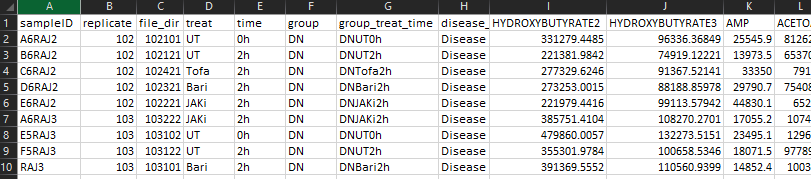

# ShinybeetlesNMR

Hi, my name is Michele Fresneda, I am a University of Liverpool PhD student working in NMR metabolomics. Long story short I have created this shiny application to streamline and have consistent reports for my data analysis.

## How to use the app

### Upload Data

the NMR data to upload should be a .csv file and have the grouping information (gender, age, condition) starting at column 1. all the other subsequent columns would be the bins (as binned from [galaxy.ac.uk](http://galaxy.liv.ac.uk/) using your own pattern file)

After uploading the data (no files larger than 300MB will be allowed) you are able to interactively filter your samples, normalise and scale your data. the resulting data can be then saved and stored for later use. in the same page you can visualize your data-frame and see changes made by the normalisation and scaling steps to your data. once you are happy with the resulting data frame you can continue to the next part of the analysis

### Univariate analysis

On this page you can chose the grouping factor. The app will be able to detect whether the chosen group has 2 or more levels.

-   if there are only 2 levels the resulting data frame shown will be a simple t.test (new functionalities will be added shorly).
-   if 3 or more levels are in your grouping factor then the app will perform an ANOVA

### PCA

If quick PCA score and loading plotting is what you need, look no further. In this page your data will be plotted and colour grouped depending on your chosen factor. You can then explore points and by just drawing a square over them. The same can be done on the loading plot, and points of interest will be plotted underneath as boxplots.

### PLS-DA

The PLS-DA is calculated using the plsda() function form the [mixOmics](http://mixomics.org/) package. (more feature will be added soon)

&nbsp;

A work by <a href="https://github.com/mikies21/">Michele Fresneda

<em>michelefresneda@gmail.com</em>

<!-- Add icon library -->
<link rel="stylesheet" href="https://cdnjs.cloudflare.com/ajax/libs/font-awesome/4.7.0/css/font-awesome.min.css">

<!-- Add font awesome icons -->

    
    
    

&nbsp;